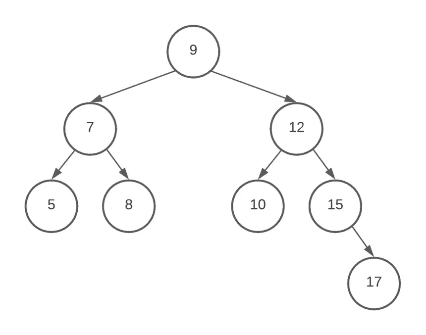

<div align="right">

### يعني ايه بقى STL ?? 
- دي يصحبي بترمز ل Standard Template Library
ايوة برضو يعني ايه ؟
بص خلينا نفهم بالظبط يعني ايه 
هنبداها من اليمين للشمال 
1.  اول حاجة Library هي عبارة عن شوية فايلات (عادة Header Files و Source Files) بتنزل وبتتسطب لما تسطب ال compiler بتاع ال C++ 
	ايوة برضو ال Libraries  دي بيبقى فيها ايه ? 
	- بص يا صحبي الفايلات دي بيبقى فيها شويه 
		1. اول حاجة Data Structures
			`ال Data Structures عبارة عن Container بيشيل شوية داتا و بيوصف شكل الداتا في الميموري و أبسط مثال لل Data Structures هي ال Array 
			الداتا ممكن تتخزن بأكتر من شكل في الميموري Tree او Array `
		2. تاني حاجة Algorithms 
			`عبارة عن شوية Lines of codes ال (process) اللي هتعملهم Apply على ال Data Structure بتاعتك زي ما مثلا انك تدور على element جوة Array الكود اللي هتكتبه هو دا الجورزم`
2. تاني حاجة Template هي عبارة عن  حاجة generic زي form كل واحد هيملاها بشكل مختلف زي مثلا 
	`ال form اللي بنملاها واحنا بنقدم على ال ITI. هي نفس ال form بس كل واحد كتب الداتا بتاعته زي اسمك و سنك والجامعة`
	- طب وهو يقصد ايه بالكلام دا يعني؟
		`يعني ان ال Data Structures اللي موجودة دي ممكن تخزن Data Types مختلفة يعني مثلا ال Array ممكن يشيل int او float او bool او String ومش بس كدة ال Template بيضحي فانت تقدر تعرف بنفسك Data Type جديدة زي class و تخلي ان ال Data Structure تاخد ال Data Type دا`
3. تالت حاجة Standard بكل بساطة علشان الناس بتوع ال community بتاعة ال c++ اتفقوا عليها ومراجعينها وان الكود بتاعها اي حد يقدر يستخدمة 


---
### طب ال STLs بيتكون من اية اصلا 
- هي تتكون من  3 حاجات 
	1.  اول حاجة Container دي الحاجة اللي ه store فيها ال داتا بتاعتي
	2. تاني حاجة Iterator دا عبارة عن الحاجة اللي بتربط بين ال container و ال algorithms `ال Iterator هو object بيشتغل زي pointer بيخليك تتحرك جوه الـ container وتوصل لأي element من غير ما تعرف تفاصيل تخزينه`
	3. تالت حاجة Algorithms دي شوية algorithms اقدر اطبقها على ال container بتاعي 
طب خلونا نفترض ان ال container بتاعي هو Array فيه شويه elements وانا عاوز اضيف element جديد فهيبقى عندي algorithm اسمه insert وال iterator دا هو مثلا pointer 
فال iterators هو اللي هيمكنني اني اشتغى على ال container بتاعي بال algorithm 

---
### طب ليه عملنا STLs اصلا 
- كان هدفهم انهم يعملوا implement لل Data Structures و ال Algorithms الأكتر استخداما بدل ما كل شويه اعمل implement بنفسي لفانكشن مثلا بتجيب ال size بتاع ال array فليه اكتبها منا استخدمها علطول 
بأختصال علشان ال Software reuse
---
### انواع ال Containers 
1. ال Sequence Containers ودي معناها ان الداتا متخزنة ورا بعض والداتا ستراكتشرز اللي بتستخدم النوع دا من ال containers 
	1. ال Array 
	2. ال Linked List
	3. ال Vector
	4. ال Dequeue
2. ال Associative Containers ودي Containers بتخزن الداتا **مرتبة Automatically** وتوصل ليها بـ **log(n)** زي الـ Tree  `هي بتستخدم Balanced Binary Search Tree (زي Red-Black Tree) علشان كده الوصول O(log n)`
	1. ال `set`
	2. ال `multiset`
	3. ال `map`
	4. ال `multimap`
3. ال Unordered Containers ودي مبنية على **Hash Tables** مش Trees ` فبالتالي الوصول average case بتاعه O(1) بس في أسوأ الأحوال ممكن يبقى O(n) لو حصل collision كتير.`
	1. ال unordered_set
	2. ال unordered_multiset
	3. ال unordered_map
	4. ال unordered_multimap
4. ال Adaptive Containers	
	1. ال queue
	2. ال Stack
	3. ال priority_queue

طب ليه احنا مكتفيناش ب Data Structure واحدة نعمل بيها كل حاجة زي ال Array؟ 
- بص مفيش داتا استراكتشر حلوة لكل حاجة كل حاجة ليها مميزات وعيوب 
`مثلا في ال array لو حبيت ادور على element معين مثلا فأنا مضطر الف على ال array كلهافهل دا افضل حل ؟ `
`مثلا برضو في ال size بتاع ال array لو انا مش عارف ال size بتاع ال data فأنا كان لازم احجز array كبير علشان اسيف الداتا`
`و ال time و ال memory برضو في حاجات بتبقى اسرع من ال array في استخدامات معينه`


ناخد مثال هنفترض اننا عندنا ال tree دي
ال tree بتضمنلي ان كل رقم محطوط اللي على يمينه اكبر منه واللي على شماله اصغر منه 
فلو عاوز ادور على رقم 5 مثلا فأنا هاخد 3 خطوات بالبط علشان الاقيها ولو array كنت هاخد في اسوأ سينارين 8 خطوات O(n)
فال tree هنا اسرع بكتير  - Searching in Balanced BST (like STL map) → **O(log n)**
`وده لأن كل خطوة بتقسم الـ tree للنص، فعدد المقارنات بيقل أُسِّيًا بدل ما تمشي على كل عنصر زي الـ array`




---

# يعني ايه بقى Vector

* بص يا صحبي خلينا نبدأها ببساطة كده، ال **Vector** هو واحد من أشهر وأهم الـ Containers في الـ STL
* الناس ساعات بتوصفه إنه **Array بس upgraded**، أو زي ما بيقولوا عليه كده
  **"Array with superpowers"**

---

## طب هو يعني إيه Array with superpowers؟

- بص، الـ Array العادي ليه شوية قيود كده بايخة:

  1. لازم تحدد الـ size بتاعه من الأول.
  2. ومينفعش تغير حجمه بعدين.
  3. ولو خلصت المساحة وعاوز تزود عنصر، خلاص، هتضطر تعمل Array جديدة وتنقل فيها البيانات.

طيب الـ Vector جه حل كل الكلام ده.
الـ Vector ببساطة **Dynamic Array** يعني حجمه بيكبر لوحده لما تحتاج.

---

## طب هو بيكبر ازاي بقى؟

- لما الـ Vector يتملي وتجي تضيف عنصر جديد، هو من ورا الكواليس بيعمل الآتي:

  1. بيحجز Array جديدة أكبر (عادة الضعف).
  2. ينقل فيها كل العناصر القديمة.
  3. ويحط العنصر الجديد كمان.

بس علشان العملية دي مكلفة شوية، بيعملها كل فترة مش كل مرة.
وده اللي بيخلي عملية الـ **insertion** تبقى **Amortized O(1)** مش O(1) دايمًا.

---

## طيب نقدر نقول عليه ايه ببساطة؟

* تقدر تعتبره كده:
  **Vector = Array بس ذكي**
  يعني بيكبر لوحده، بيحسب الـ size، وبيسهل الوصول لأي عنصر عن طريق الـ index زي الـ Array بالظبط.

---

## مميزات الـ Vector

1. بيخزن البيانات ورا بعض في الميموري (Contiguous memory).
2. تقدر توصل لأي عنصر في **O(1)** زي الـ Array.
3. حجمه بيتغير أوتوماتيك لما تعمل push_back().
4. بيشتغل بكفاءة عالية مع الـ Iterators والـ Algorithms بتاعت الـ STL.

---

## عيوبه

1. لما بيحصل reallocation (لما يتملي ويكبر) بياخد وقت لأنه بينسخ كل العناصر.
2. مش مناسب لو عاوز تضيف أو تحذف في النص كتير — هنا الـ list أو الـ deque أفضل.

---


</div>

## دا Implementation بسيط للـ Vector باستخدام Array

```cpp
class MyVector {
    int* arr;
    int size;
    int capacity;
public:
    MyVector() {
        arr = new int[1];
        size = 0;
        capacity = 1;
    }
    void push_back(int value) {
        if (size == capacity) {
            capacity *= 2;
            int* newArr = new int[capacity];
            for (int i = 0; i < size; i++)
                newArr[i] = arr[i];
            delete[] arr;
            arr = newArr;
        }
        arr[size++] = value;
    }
};
```

<div align="right">


كده ببساطة فهمت الفكرة العامة اللي الـ STL بتعملها جوه الـ vector الحقيقي.

---

ال Vector هو عبارة عن Array with extra steps 
- ال vector عبارة عن dynamic array احنا بنقول ان ال vector عبارة عن array بس بيتغير ال size بتاعة طب ازاي 
	`ال vector مش array ال size بتاعه بيتغير هو array static عادي. امال ايه اللي بيحصل بالظبط:
	اللي بيحصل اني لما باجي اضيف element جديد لل vector لو ال array اللي جوة اتملى فال vector لما يتملي، بيعمل reallocation لـ array جديدة أكبر (عادةً 1.5x أو 2x من الحجم القديم) وينقل فيها كل العناصر.”
	طبعا دا بيأثر على سرعة ال  insertion لل elements يعني هنا ال insertion مش بنقول عليه O(1) لا دا بيتقال عليه Amortized O(1) علشان هو O(1) بس هييجي في كام مرة وانت يتعمل insert هيقلب معاك O(n) فنخلي بالنا من الموضوع دا`
- ممكن اكتب ال implementation لل vector بستخدام array عادي 


</div>


## Learn more

You can learn more and see vector methods at [vector](https://cplusplus.com/reference/vector/vector/).

## **Example: `vector` (Dynamic Array)**

```c++
#include <iostream>
#include <vector>
using namespace std;

int main() {
    vector<int> v;

    // Adding elements
    v.push_back(10);
    v.push_back(20);
    v.push_back(30);

    // Access elements
    cout << "Vector elements: ";
    for (int x : v)
        cout << x << " ";

    cout << "\nFront: " << v.front();
    cout << "\nBack: " << v.back();
    cout << "\nSize: " << v.size() << endl;

    // Remove last element
    v.pop_back();

    cout << "After pop_back(): ";
    for (int x : v)
        cout << x << " ";

    return 0;
}

```

---

## `queue` (C++) First In First Out

<div align="right">

# يعني ايه بقى Queue

* الـ **Queue** ببساطة هي **طابور**، نفس فكرة الطابور اللي بنقف فيه في أي مكان.
  أول واحد دخل الطابور هو أول واحد يخرج.
  يعني النظام بتاعه اسمه **FIFO — First In First Out**.

---

## طب تعال نفهمها أكتر

* تخيل إن عندك طابور في بنك:
  أول واحد وصل للشباك هو أول واحد خلص وخرج.
  نفس الكلام بيحصل جوه الـ `queue` في C++.
* كل مرة تعمل `push()` بتضيف عنصر **في آخر الطابور**.
* وكل مرة تعمل `pop()` بتشيل **أول عنصر دخل**.

---

## مكونات الـ Queue

1. المكون اللأول **Front** → أول عنصر دخل الطابور (اللي هيخرج الأول).
2. المكون الثاني **Back** → آخر عنصر دخل الطابور (اللي لسه منتظر).

---

## استخدامات الـ Queue

- بتستخدم لما تكون العمليات لازم تحصل **بالترتيب اللي جت بيه**.
  زي مثلًا:
  * إدارة الطباعة (Printer Queue).
  * جدولة المهام في أنظمة التشغيل.
  * الـ BFS (Breadth First Search) في الـ Graphs.

</div>

## Learn more

You can learn more and see queue methods at [queue](https://cplusplus.com/reference/queue/queue/).
  
---

## **Example: `queue` (First In First Out — FIFO)**

```c++
#include <iostream>
#include <queue>
using namespace std;

int main() {
    queue<int> q;

    // Adding elements
    q.push(10);
    q.push(20);
    q.push(30);

    cout << "Front element: " << q.front() << endl;
    cout << "Back element: " << q.back() << endl;

    // Removing elements (FIFO)
    q.pop(); // removes 10

    cout << "After one pop(), front = " << q.front() << endl;
    cout << "Queue size = " << q.size() << endl;

    return 0;
}

```
---

## `std::stack` (C++) First In Last Out

<div align="right">

# يعني ايه بقى Stack

* الـ **Stack** يا صاحبي هو زي كومة طبق فوق بعض.
  أول طبق تحطه هو **آخر واحد هيتشال**، وده اللي بنسميه مبدأ
  **LIFO — Last In First Out**.

---

## طب يعني ايه LIFO؟

* ببساطة كده، كل عنصر جديد بتحطه بيتحط **فوق** اللي قبله.
* لما تيجي تشيل عنصر، بتشيل **اللي فوق** بس، مش اللي في النص.

يعني:

1. تضيف عنصر بـ `push()` → بيتحط فوق الكومة.
2. تشيل عنصر بـ `pop()` → بيتشال آخر عنصر دخل.
3. تبص على آخر عنصر من غير ما تشيله بـ `top()`.

---

## استخدامات الـ Stack

الـ Stack بيتستخدم في مواقف كتير في البرمجة زي:

* تنفيذ الـ **Recursion** (الدوال بتستدعي نفسها).
* **Undo / Redo** في البرامج (زي Ctrl+Z في الـ Word).
* **تحليل المعادلات الرياضية** (Infix → Postfix).
* **Stack Memory** اللي بتخزن فيها المتغيرات المؤقتة في الـ RAM.


</div>

## Learn more

You can learn more and see stack methods at [stack](https://cplusplus.com/reference/stack/stack/).


## ** Example: `Stack` First In Last Out**

```c++
#include <iostream>
#include <deque>
using namespace std;

int main() {
    deque<int> dq;

    // Add elements from both ends
    dq.push_back(10);
    dq.push_front(5);
    dq.push_back(15);

    cout << "Deque elements: ";
    for (int x : dq)
        cout << x << " ";

    cout << "\nFront: " << dq.front();
    cout << "\nBack: " << dq.back() << endl;

    // Remove from both ends
    dq.pop_front();
    dq.pop_back();

    cout << "After popping front & back: ";
    for (int x : dq)
        cout << x << " ";

    cout << "\nSize: " << dq.size() << endl;

    return 0;
}

```


---

## Problem Sheet

You can find the problems sheet here [Problem Sheet](https://vjudge.net/contest/762706).

here is the invitation for the Vjudge Group [invitation](https://vjudge.net/group/psl2?r=Ri0nutenJQdtDwCH9Xat).