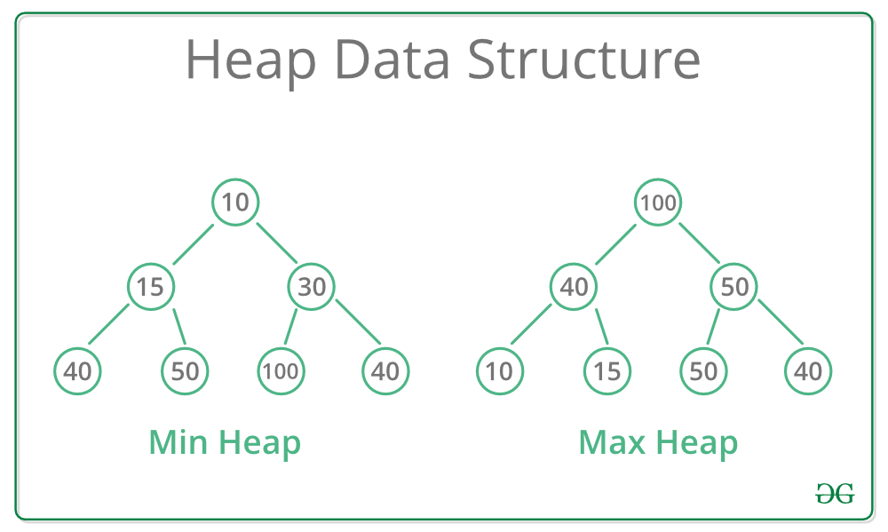

<div align="right">

## ال `std::priority_queue` (C++) — Highest Priority First

من الاسم كدة يا شباب ال Priority Queue هو عبارة عن Queue عادي بس ليه اولوية معينة من اسمه يعني 
هو بيكون implemented بحيث انه يضمن ان الحاجة اللي على ال Top بتاعه هو ال Maximum اللي في ال Queue بس خلي بالك، العناصر جوا الـ priority_queue مش مرتبة بالكامل زي الـ vector، هو بس بيضمن إن أول عنصر (`top`) هو الأعلى أولوية، لكن الباقي مش لازم يكونوا مترتبين.

طب احنا استفدنا ايه بقى ؟
افرض مثلا انك بتعمل insert لدرجات طلبة وكل مره بتدخل رقم عاوز تعرف مين اعلى درجة او اعلى طالب وكل مرة تحذف طالب تطبع اعلى واحد برضو
فكنت هتعمل ايه ؟

الحل الاول انك تعمل vector مثللا وتفضل تضيف وتشيل منه وكل مرة تعمل عمليه ترتيب للارقام وتجيب ال maximum (ال Time سيئ جدا)
الحل التاني انك تستخدم ال Priority Queue 

طب افرض اني عاوز اجيب ال Minimum ؟
سهلة جدا نضرب القيم في -1 قبل ما ندخلها لل queue هيبقى ال Top اللي في ال priority_queue شايل اكبر قيمه برضو بس احنا ضربناهم في -1 فهي فعليا اصغر قيمة
او في حل تاني انك تستخدم comparator


</div>


```c++
int main(){
	priority_queue<int,vector<int>,greater<int>>pq;
	// دا كدة التوب شايل اصفر قيمة
	return 0;
}
```

<div align="right">

#### الخلاصة: 
الـ priority_queue هو نوع من الـ **container adaptors** في الـ STL (Standard Template Library) بتاع الـ C++. هو مش container مستقل زي الـ vector أو list، لكنه adaptor بيبنى على container تاني (افتراضيًا vector) ويضيف عليه سلوك معين. الفكرة الرئيسية إنه بيخزن العناصر حسب **الأولوية (priority)**، مش حسب الترتيب اللي دخلوا بيه زي الـ queue العادي.

---
### الـ Binary Heap: الأساس اللي عليه مبني الـ priority_queue

علشان تفهم الـ priority_queue، لازم نفهم الـ **binary heap**. ده شجرة ثنائية كاملة (كل مستوى مليان إلا الآخر ممكن يكون ناقص من اليمين للشمال)، وبتحافظ على خاصية الـ heap:

- في **max-heap**: كل parent أكبر من أو يساوي أولاده.
- في **min-heap**: كل parent أصغر من أو يساوي أولاده.

**تمثيل الـ heap كـ array:** الشجرة مش بتنفذ كـ nodes حقيقية، لكن كـ vector. الـ root في index 0، والأولاد اليسرى في  2i+1 ، واليمين في 2i+2 . ده بيجعل العمليات سريعة.



### ايه هو الـ heapify-down بالتفصيل؟

الـ heapify-down (أو sift-down) هو عملية أساسية في الـ heap علشان تحافظ على خاصية الـ heap بعد إزالة أو تعديل عنصر في الأعلى. هو اللي بيحصل أساسًا في الـ pop للـ priority_queue.

- ازاي بيشتغل؟
    - ابدأ من العنصر اللي اتغير (عادة الـ root بعد الاستبدال).
    - قارن العنصر ده مع أولاده الاثنين (left و right).
    - لو العنصر أصغر من أكبر ولد (في max-heap)، استبدله مع أكبر ولد.
    - كرر الخطوة دي للولد الجديد، لحد ما يبقى العنصر في مكانه الصح (أكبر من أولاده) أو لحد ما يوصل لورقة (leaf).
- **Time Complexity:** O(log n)، لأن عمق الشجرة log n.

</div>


---

### Modifiers

| Function                      | Description                                                         |
| ----------------------------- | ------------------------------------------------------------------- |
| `push(const T& value)`        | Inserts a new element and reorders to maintain the heap property    |
| `push(T&& value)`             | Inserts an **rvalue** (move semantics)                              |
| `emplace(args...)`            | Constructs an element **in-place** inside the queue                 |
| `pop()`                       | Removes the top (highest priority) element (does **not** return it) |
| `swap(priority_queue& other)` | Swaps contents with another priority queue                          |

---
### Element Access

| Function            | Description                                   |
| ------------------- | --------------------------------------------- |
| `top()`             | Reference to the **highest priority** element |
| `const top() const` | Const version of `top()`                      |

---

### Capacity

| Function  | Description                      |
| --------- | -------------------------------- |
| `empty()` | Returns `true` if queue is empty |
| `size()`  | Returns number of elements       |

---

### Template Parameters

| Parameter   | Description                                                       |
| ----------- | ----------------------------------------------------------------- |
| `T`         | Type of the stored elements                                       |
| `Container` | Underlying container type (default: `std::vector<T>`)             |
| `Compare`   | Comparison function object (default: `std::less<T>` for max-heap) |

---

### Example

```cpp
#include <iostream>
#include <queue>
#include <vector>
#include <functional>

int main() {
    std::priority_queue<int> maxHeap; // Default: max-heap
    std::priority_queue<int, std::vector<int>, std::greater<int>> minHeap; // Min-heap

    maxHeap.push(10);
    maxHeap.push(30);
    maxHeap.push(20);

    std::cout << "Top (max): " << maxHeap.top() << "\n"; // 30
    maxHeap.pop();
    std::cout << "After pop, top: " << maxHeap.top() << "\n"; // 20

    std::cout << "Size: " << maxHeap.size() << "\n";
    std::cout << "Empty? " << (maxHeap.empty() ? "Yes" : "No") << "\n";

    minHeap.push(5);
    minHeap.push(1);
    minHeap.push(10);
    std::cout << "Top (min): " << minHeap.top() << "\n"; // 1
}
```

--- 

<div align="right">


##  ال `std::set (C++) — Sorted Unique Container`

ال Set عبارة عن داتا استراكتشر كل فكرتها اني هديها شويه داتا وهي هترتبهوملي وهتخزنهوملي في الميموري وفي نفس الوقت مفيش حاجة متكررة 
ال Set بتضمنلي كذا حاجة 
1. كل ال elements هتكون sorted من الصغير للكبير 
2. كل ال elements هتكون unique 
جة بقى منين موضوع ان الحاجة تكون sorted 
جات من ان ال set و ال map تبع نوع Containers اسمة Associative Containers 
كلمة Associative دي معناها اية بق 
- جاية من اني بربط حاجة بحاجة زي مثلا في الماب انا بربط ال key بال value 
	- الفكرة انها بتخزن ال elements بتاعتي as a pairs كده حاجتين مربوطين ببعض 
	- طب في حالة ال set  ايه اللي بيحصل `ال set بتخزنلي ال keys بس اللي هي الداتا بيكونوا sorted و unique`
	- طب ليه ال set و ال map اتحطوا مع بعض ؟  `لان الاتنين بيستخدموا حاجة اسمها binary search tree في ال implementation بتاعهم` 

![Binary Search Tree][binary_search_tree.webp]

`لاحظ ان ال left most leaf هي اصغر قيمة في ال tree و ال right most leaf هي اكبر قيمة في ال tree بتاعتنا اللي هما في الرسمة هنا ال 5 و ال 17 `

لو عاوز تخلي ال set ترتب من الكبير للصغير بدل ال default `من الصغير للكبير` تقدر تستخدم comparator 


</div>


```c++
int main(){
	std::set<int, std::greater<int>> s = {1, 5, 3};
	return 0;
}
```


<div align="right">


فلو عاوز ادور على رقم 5 مثلا فأنا هاخد 3 خطوات بالبط علشان الاقيها ولو array كنت هاخد في اسوأ سيناريو 8 خطوات O(n) 

فال tree هنا اسرع بكتير  - Searching in Balanced BST (like STL map) → **O(log n)**
اللي هو ال depth بتاع ال tree 

طب لو انا عاوز اطبع ال elements اللي في ال tree مترتبين امشي ازاي
هتمشي بالطريقة دي
1. ال  left subtree اللي هو 5
2. ال root اللي هو 7
3. ال right subtree اللي هو 8
4. ال parent بتاع ال root اللي هو 9
5. وهينزل يمين يكمل ال right subtree اللي تحت ال 9

الشكل اللي فوق هو عبارة عن  Balanced Binary Search tree مش Binary Search Tree عادية
- يعني كل level في ال tree filled مفيش branch لل  tree اعلى من الباقي ودا هيضمنلي ان ال time complexty دايما (log(n))O
في دايما Algorithms دايمن بتشتغل انهي تخلي ال tree بتاعتي balanced زي 

| النوع               | الاسم الكامل                           | فكرة التوازن                                                                |
| ------------------- | -------------------------------------- | --------------------------------------------------------------------------- |
| **AVL Tree**        | Adelson-Velsky and Landis Tree         | بتوازن نفسها بعد كل عملية إدخال أو حذف عن طريق **rotations**                |
| **Red-Black Tree**  | (المستخدمة في `std::set` و `std::map`) | بتوازن نفسها باستخدام خصائص ألوان (Red / Black) تضمن إن العمق ما يزيدش كتير |
| **B-Tree / B+Tree** | (تستخدم في قواعد البيانات)             | بتحافظ على التوازن لكن بتخزن أكتر من قيمة في كل node، مش قيمتين بس          |
| **Splay Tree**      | Self-adjusting BST                     | بتحرك العنصر اللي استخدمته مؤخرًا فوق علشان الوصول السريع له بعدين          |
| **Treap**           | Tree + Heap                            | بتمزج بين أفكار الـ BST والـ Heap وتستخدم random priorities للتوازن         |
##### ال MultiSet : ال elements بتكون Sorted بس مش unique.

ملحوظة :
- ال set  مفيهاش Random Access يعني مينفعش اعمل كدة

</div>


```c++
int main(){
	set<int>st;
	st.insert(5);
	st.insert(1);
	st.insert(2);
	st.insert(3);
	for(int i=0;i<n;i++)cout<<st[i]; // wronnnng
	
	for(auto it=st.begin();it!=st.end();++it)cout<<*it; // this is right using iterators
	
	for(auto num:st)cout<<num; // another way to apply for loob on a set
}
```

### Modifiers

|Function|Description|
|---|---|
|`insert(const T& value)`|Inserts a new element (if not already present)|
|`insert(T&& value)`|Inserts an **rvalue** element using move semantics|
|`emplace(args...)`|Constructs an element **in-place** inside the set|
|`erase(iterator pos)`|Removes the element at the given iterator position|
|`erase(const T& key)`|Removes the element with the given key (if it exists)|
|`erase(iterator first, iterator last)`|Removes a **range** of elements|
|`clear()`|Removes **all** elements from the set|
|`swap(set& other)`|Swaps contents with another set|

---

### Lookup

|Function|Description|
|---|---|
|`find(const T& key)`|Returns iterator to the element with the given key, or `end()` if not found|
|`count(const T& key)`|Returns `1` if the element exists, otherwise `0`|
|`contains(const T& key)` _(C++20+)_|Returns `true` if element exists|
|`lower_bound(const T& key)`|Returns iterator to the **first element ≥ key**|
|`upper_bound(const T& key)`|Returns iterator to the **first element > key**|
|`equal_range(const T& key)`|Returns a pair of iterators `(lower_bound, upper_bound)`|

---

### Iterators

|Function|Description|
|---|---|
|`begin()` / `cbegin()`|Iterator to the **first (smallest)** element|
|`end()` / `cend()`|Iterator to **past-the-last** element|
|`rbegin()` / `crbegin()`|Reverse iterator to the **largest** element|
|`rend()` / `crend()`|Reverse iterator to **before-the-first** element|

---

### Capacity

|Function|Description|
|---|---|
|`empty()`|Returns `true` if set is empty|
|`size()`|Returns the number of elements|
|`max_size()`|Returns the maximum number of elements the set can hold|

---

### Observers

|Function|Description|
|---|---|
|`key_comp()`|Returns the comparison object used to order the keys|
|`value_comp()`|Returns the same as `key_comp()` (since key = value in set)|

---

### Template Parameters

|Parameter|Description|
|---|---|
|`T`|Type of the elements (also acts as the key)|
|`Compare`|Function object for sorting (default: `std::less<T>`)|
|`Allocator`|Memory allocator (default: `std::allocator<T>`)|

---

<div align="right">


## ال `std::map` (C++) — Ordered Key–Value **Associative** Container

>  **الـ `map`** عبارة عن container بيخزن البيانات في شكل  
> **(key → value)**  
> والـ keys بتكون **unique** ومتخزنة **بالترتيب التصاعدي تلقائيًا** (عن طريق **Balanced Binary Search Tree — Red-Black Tree**).

</div>


---


### **Basic Declaration**

```c++
#include <iostream>
#include <map>
using namespace std;

int main() {
    map<int, string> mp;

    mp[1] = "Ahmed";
    mp[2] = "Youssef";
    mp[3] = "Omar";

    for (auto p : mp)
        cout << p.first << " -> " << p.second << endl;

    return 0;
}

```
## **Modifiers**

| Function               | Description                                               | Example                  |
| ---------------------- | --------------------------------------------------------- | ------------------------ |
| `insert({key, value})` | Inserts a new element (if the key does not already exist) | `mp.insert({4, "Ali"});` |
| `emplace(key, value)`  | Constructs an element in-place (faster than `insert`)     | `mp.emplace(5, "Sara");` |
| `erase(key)`           | Removes an element by its key                             | `mp.erase(2);`           |
| `erase(iterator)`      | Removes the element at the given iterator position        | `mp.erase(mp.begin());`  |
| `clear()`              | Removes all elements from the map                         | `mp.clear();`            |
| `swap(otherMap)`       | Exchanges contents with another map                       | `mp.swap(other);`        |

---

## **Element Access**

| Function     | Description                                                              | Example             |
| ------------ | ------------------------------------------------------------------------ | ------------------- |
| `operator[]` | Access or insert element by key (creates a new element if key not found) | `mp[1] = "Ali";`    |
| `at(key)`    | Access element by key (throws `out_of_range` if key not found)           | `cout << mp.at(1);` |

---

## **Lookup / Search**

| Function           | Description                                              | Example                              |
| ------------------ | -------------------------------------------------------- | ------------------------------------ |
| `find(key)`        | Returns iterator to the element, or `end()` if not found | `auto it = mp.find(3);`              |
| `count(key)`       | Returns `1` if the key exists, `0` otherwise             | `if (mp.count(4)) cout << "exists";` |
| `lower_bound(key)` | Returns iterator to the first element **≥ key**          | `mp.lower_bound(2);`                 |
| `upper_bound(key)` | Returns iterator to the first element **> key**          | `mp.upper_bound(2);`                 |
| `equal_range(key)` | Returns a pair of iterators `[lower_bound, upper_bound)` | `auto range = mp.equal_range(2);`    |

---

## **Capacity**

| Function     | Description                                     | Example                            |
| ------------ | ----------------------------------------------- | ---------------------------------- |
| `size()`     | Returns the number of elements                  | `cout << mp.size();`               |
| `empty()`    | Returns `true` if the map is empty              | `if (mp.empty()) cout << "Empty";` |
| `max_size()` | Returns the maximum number of elements possible | `cout << mp.max_size();`           |

---

## **Iterators**

| Function             | Description                             | Example                  |
| -------------------- | --------------------------------------- | ------------------------ |
| `begin()`            | Iterator to the first element           | `auto it = mp.begin();`  |
| `end()`              | Iterator past the last element          | `auto it = mp.end();`    |
| `rbegin()`           | Reverse iterator to the last element    | `auto it = mp.rbegin();` |
| `rend()`             | Reverse iterator past the first element | `auto it = mp.rend();`   |
| `cbegin()`, `cend()` | Constant iterators (read-only access)   | –                        |

---

## **Example: All-in-One**
```c++
#include <iostream>
#include <map>
using namespace std;

int main() {
    map<int, string> students;

    // Insert elements
    students.insert({1, "Ahmed"});
    students.emplace(2, "Youssef");
    students[3] = "Omar";

    // Access
    cout << "Student 1: " << students.at(1) << endl;

    // Iterate
    cout << "\nAll students:\n";
    for (auto& s : students)
        cout << s.first << " -> " << s.second << endl;

    // Search
    if (students.count(2))
        cout << "\nStudent 2 exists!\n";

    // Erase
    students.erase(3);

    // lower_bound / upper_bound
    auto it = students.lower_bound(1);
    cout << "\nLower bound of 1: " << it->first << " -> " << it->second << endl;

    cout << "\nMap size = " << students.size() << endl;

    return 0;
}

```

---

<div align="right">


## **ملاحظات مهمة**
- ترتيب العناصر دايمًا بيكون حسب **الـ key**.
- الوقت بتاع أي عملية بحث / إدخال / حذف = **O(log n)** (لأنها مبنية على **Balanced BST**).
- لو عايز map مش بترتب العناصر استخدم → **`unordered_map`** (مبنية على **Hash Table** وتديك متوسط O(1)**).


</div>
